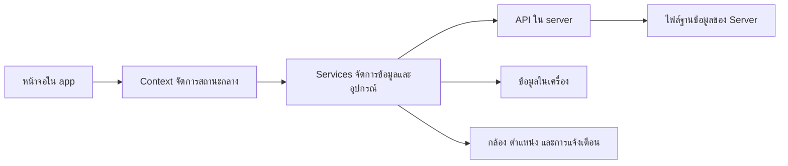

# Nong Khai Trip 🌿

แอปวางแผนเที่ยวหนองคายบน **iOS / Android** ในธีมขาว–ดำ–เขียวมะนาว รวมความรู้จาก Assignment **Week 1–12** ไว้ในโปรเจกต์ `AppNong Khai Trip_Hybrid_Mobile`

## ทำอะไรได้บ้าง

- ค้นหาสถานที่ ดูรายละเอียด และบันทึกรายการโปรด
- สร้างทริป กำหนดวันไป–กลับ และจัดสถานที่แยกแต่ละวัน
- ตั้งเวลาเที่ยว ดูแผนที่เต็มจอ และรับการแจ้งเตือน
- ถ่ายรูปหรือเลือกรูป เก็บเป็นอัลบั้มความทรงจำของทริป

**เริ่มใช้งาน:** สำรวจสถานที่ → กดหัวใจ → สร้างทริป → เลือกวันและสถานที่ → ตั้งเวลาเที่ยว

[ดูขั้นตอนทั้งหมดและ Flow การใช้งาน →](docs/USER_GUIDE.md)

## เปิดโปรเจกต์

ใช้ Node.js **22.13 ขึ้นไป** และ Expo Go ที่รองรับ SDK ของโปรเจกต์ หรือ Development Build ที่ตรงกัน โปรเจกต์ใช้ Expo 57 และ React Native 0.86.3

ติดตั้งในโฟลเดอร์โปรเจกต์:

```bash
npm ci
```

เปิดสอง Terminal ในโฟลเดอร์เดียวกัน:

| Terminal | คำสั่ง               | หน้าที่          |
| -------- | -------------------- | ---------------- |
| 1        | `npm run server`     | เปิด API         |
| 2        | `npm start -- --lan` | เปิดแอปผ่าน Expo |

ให้มือถือและคอมพิวเตอร์อยู่ Wi-Fi เดียวกัน แล้วสแกน QR ล่าสุด

**บัญชีสาธิต:** `jutatip@gmail.com` · **รหัสผ่าน:** `123456`

ถ้า API รีสตาร์ตให้เข้าสู่ระบบใหม่ หากเชื่อมต่อไม่ได้ ดู [วิธีตั้งค่า API และแก้ปัญหา](docs/SETUP.md)

## โครงสร้างไฟล์และสถาปัตยกรรม (Project Structure)

```text
AppNong Khai Trip_Hybrid_Mobile/
├── app/                 หน้าจอและเส้นทางของแอป
│   ├── (tabs)/          เมนูหลัก: สำรวจ แผนที่ ทริป รายการโปรด และโปรไฟล์
│   ├── places/[id].tsx  หน้ารายละเอียดสถานที่ตาม ID
│   └── trips/           หน้าสร้าง แก้ไข และดูรายละเอียดทริป
├── src/
│   ├── components/      ส่วน UI ที่นำกลับมาใช้ได้ เช่น การ์ดสถานที่และกล้อง
│   ├── context/         สถานะส่วนกลางของบัญชี สถานที่ และทริป
│   ├── services/        เชื่อม API จัดเก็บข้อมูล แจ้งเตือน กล้อง และตำแหน่ง
│   ├── data/            ข้อมูลสถานที่เริ่มต้นสำหรับระบบ
│   ├── theme/           สี ตัวอักษร และรูปแบบหน้าตาของแอป
│   ├── types/           รูปแบบข้อมูลของสถานที่และทริป
│   └── utils/           ฟังก์ชันช่วยจัดวัน เวลา และแผนการเดินทาง
├── server/              API สำหรับเข้าสู่ระบบ สถานที่ ทริป และภาพความทรงจำ
├── docs/                คู่มือใช้งาน การติดตั้ง การทดสอบ และ Assignment
├── assets/              รูปภาพ ไอคอน และทรัพยากรของแอป
├── app.config.ts        ตั้งค่า Expo และค่าที่รับจาก Environment
└── package.json         รายการแพ็กเกจและคำสั่งสำหรับเปิดหรือทดสอบระบบ
```

ระบบแยกหน้าที่เป็นชั้นเพื่อให้ดูแลและแก้ไขได้ง่าย:



| ส่วนของระบบ       | หน้าที่แบบเข้าใจง่าย                                                                      |
| ----------------- | ----------------------------------------------------------------------------------------- |
| **หน้าจอ (UI)**   | แสดงข้อมูล รับการกดปุ่ม และพาผู้ใช้ไปยังหน้าต่าง ๆ                                        |
| **Context**       | เก็บสถานะที่หลายหน้าต้องใช้ร่วมกัน เช่น บัญชี รายการโปรด และทริป                          |
| **Services**      | เป็นตัวกลางระหว่างหน้าจอกับ API ข้อมูลในเครื่อง และความสามารถของมือถือ                    |
| **Server / API**  | ตรวจสอบคำขอ เข้าสู่ระบบ และอ่านหรือบันทึกข้อมูลสถานที่กับทริป                             |
| **Local Storage** | เก็บ Session รายการโปรด Cache และข้อมูลรอส่ง เพื่อให้ระบบใช้งานต่อได้เมื่อสัญญาณไม่เสถียร |

ตัวอย่างการไหลของข้อมูล: ผู้ใช้กดหัวใจที่หน้าสถานที่ → `AppContext` อัปเดตรายการโปรด → `services` บันทึกข้อมูลลงเครื่อง → หน้ารายการโปรดแสดงข้อมูลใหม่ทันที ส่วนการสร้างหรือแก้ไขทริปจะส่งผ่าน `TripContext` ไปยัง API และเก็บ Cache ไว้ใช้เมื่อเชื่อมต่อไม่ได้

[ดูรายละเอียดการเก็บข้อมูล API และ Flow ภายในระบบ →](docs/ARCHITECTURE.md)

## Assignment ในระบบ

| Week | นำมาใช้กับอะไร                                       |
| ---- | ---------------------------------------------------- |
| 1    | ตั้งโปรเจกต์ React Native / Expo และหน้าโปรไฟล์      |
| 2    | Component การ์ดสถานที่ ปุ่มหัวใจ และ State           |
| 3    | ธีม การจัดหน้า และรายการที่ปรับตามขนาดจอ             |
| 4    | เปลี่ยนหน้าด้วย Tabs / Stack และเปิดรายละเอียดตาม ID |
| 5    | ฟอร์มสร้างทริป วันไป–กลับ และตรวจเวลาเที่ยว          |
| 6    | API โหลดสถานที่และจัดการทริป                         |
| 7    | เก็บรายการโปรด ข้อมูลออฟไลน์ และภาพรอส่ง             |
| 8    | เข้าสู่ระบบ เก็บ Session และตรวจสิทธิ์เจ้าของทริป    |
| 9    | กล้อง เลือกรูป แต่งโทน และบันทึกภาพ                  |
| 10   | ตำแหน่งปัจจุบันและแผนที่สถานที่                      |
| 11   | แจ้งเตือนเวลาเที่ยวและปุ่มทดลองเตือน 10 วินาที       |
| 12   | จัดโครงสร้างโค้ด ตรวจประสิทธิภาพ และการเข้าถึง       |

[ดูบทเรียน โค้ดที่เกี่ยวข้อง และหลักฐานก่อนส่ง →](docs/ASSIGNMENT.md)

## เอกสารเพิ่มเติม

| อยากดูเรื่องไหน                        | เปิดเอกสาร                            |
| -------------------------------------- | ------------------------------------- |
| ขั้นตอนใช้งาน, Flow และทดลองแจ้งเตือน  | [คู่มือใช้งาน](docs/USER_GUIDE.md)    |
| ติดตั้ง, API, ปัญหาเชื่อมต่อ และ Build | [การตั้งค่าระบบ](docs/SETUP.md)       |
| การเก็บข้อมูลและ API ภายในระบบ         | [โครงสร้างระบบ](docs/ARCHITECTURE.md) |
| บทเรียนและหลักฐาน Week 1–12            | [Assignment](docs/ASSIGNMENT.md)      |
| ผลตรวจและสิ่งที่ต้องทดสอบบนมือถือ      | [การทดสอบ](docs/TESTING.md)           |
| ที่มาและการปรับโค้ดกล้อง               | [โค้ดกล้อง](docs/CAMERA_SOURCE.md)    |

## สถานะและลิงก์โปรเจกต์

มีโค้ดครอบคลุมหัวข้อความรู้ Week 1–12 แต่ยังต้องทดสอบฟังก์ชันบนมือถือจริงและแนบหลักฐานก่อนส่ง โดยเฉพาะ Profiler, VoiceOver/TalkBack และตัวอักษร 200% ของ Week 12 แอปใช้บัญชีสาธิตและเน้นการใช้งานบนมือถือ

[GitHub โปรเจกต์](https://github.com/jutatipp/appNong-Khai-Trip_Assignment11) · [GitHub กล้องต้นฉบับ](https://github.com/jutatipp/Photo_camera-_expo)
