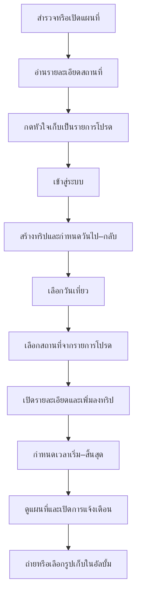

# คู่มือใช้งาน Nong Khai Trip

## Flow หลัก

## ขั้นตอนใช้งาน

### 1. สำรวจสถานที่

- ค้นหาจากชื่อหรืออำเภอ และกรองตามหมวดหมู่
- แตะการ์ดเพื่ออ่านรายละเอียดและดูตำแหน่ง
- กดหัวใจเพื่อเก็บสถานที่ไว้ในรายการโปรด
- ปุ่ม **เพิ่มลงทริป** อยู่ในหน้ารายละเอียดสถานที่

### 2. สร้างทริป

- เข้าสู่ระบบด้วยบัญชีสาธิต
- เปิดแท็บ **ทริปของฉัน** แล้วกดสร้างทริป
- กรอกชื่อทริป วันเวลาเริ่ม และวันเวลากลับ
- ระบบสร้างวันที่ 1, 2, 3 ตามช่วงวันที่เลือก

### 3. เพิ่มสถานที่ในแต่ละวัน

- เลือกแท็บวันที่ต้องการแล้วกดเพิ่มสถานที่
- ระบบแสดงเฉพาะรายการโปรดที่ยังไม่อยู่ในทริป
- เปิดอ่านรายละเอียดแล้วกดเพิ่มลงวันนั้น
- สถานที่จะแสดงในวันเที่ยวทันที แม้ยังไม่ได้กำหนดเวลา

### 4. กำหนดเวลาเที่ยว

- แตะสถานที่ในแผนรายวัน
- เลือกวันที่ พร้อมเวลาเริ่มและเวลาสิ้นสุด
- รายการที่ยังไม่มีเวลาจะแสดงสถานะให้เห็นชัดเจน
- ล้างเวลาได้โดยสถานที่ยังคงอยู่ในวันที่เลือก

### 5. แผนที่และการแจ้งเตือน

- เปิดแผนที่เต็มจอเพื่อดูหมุดทั้งหมดในทริป
- เปิดการแจ้งเตือนหลังจากกำหนดเวลาเที่ยวในอนาคต
- ระบบเตือนเมื่อถึงเวลาเริ่มเที่ยวของแต่ละสถานที่
- แตะการแจ้งเตือนเพื่อเปิดทริปที่เกี่ยวข้อง

### 6. ภาพความทรงจำ

- ถ่ายรูปหรือเลือกภาพจากคลังในหน้ารายละเอียดทริป
- เลือกโทนภาพและตรวจ Preview ก่อนบันทึก
- เปิดคลังภาพเพื่อดูรูปทั้งหมดของทริป
- แตะรูปเพื่อเปิดภาพใหญ่และบันทึกลงคลังมือถือ

## ทดลองแจ้งเตือนใน 10 วินาที

1. เข้าสู่ระบบและเปิดทริปใดก็ได้
2. กด **ทดลองแจ้งเตือนใน 10 วินาที**
3. อนุญาตสิทธิ์แจ้งเตือน แล้วรอ 10 วินาที
4. แตะการแจ้งเตือน ระบบควรเปิดทริปเดิม

ปุ่มทดลองแยกจากการแจ้งเตือนตามเวลาเที่ยวจริง กดซ้ำแล้วระบบจะเริ่มนับใหม่โดยไม่สะสมรายการเดิม

## การใช้งานเมื่อออฟไลน์

- เปิดสถานที่และทริปที่เคยโหลดได้จาก Cache
- รายการโปรดยังคงอยู่ในอุปกรณ์
- เพิ่มภาพในทริปเดิมได้เมื่อ Session ยังไม่หมดอายุ ภาพจะแสดงสถานะรอส่ง
- เมื่อเชื่อมต่ออีกครั้ง ระบบจะลองส่งภาพและโหลดข้อมูลล่าสุด
- การสร้าง แก้ไข และลบทริปยังต้องเชื่อมต่อ API
- แผนที่ฐานและรูปสถานที่ออนไลน์อาจไม่แสดงเมื่อไม่มีอินเทอร์เน็ต
